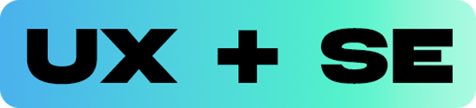

# Hi there, I'm Jerrick! 👋

# 💻 Tech Stack:
 
 
 
 
 
                  
# 📊 GitHub Stats:
 
 

---

<!-- Proudly created with GPRM ( https://gprm.itsvg.in ) -->

I’m a **Software engineer**, **UX designer**, and **Game developer** at LSU passionate about using technology to design meaningful, user-focused experiences.

I am passionate about using technology to design meaningful :hammer:, user-focused experiences. For me, 'Build your tomorrow' means using technology thoughtfully – focusing on creating user-centered solutions , constantly learning, and aiming to build things that help connect and uplift others :bulb:. It's about progress, not perfection, and making a positive contribution, one step at a time.
More than the technical challenge, I'm driven by the potential I see in technology to foster connection and uplift communities. I know I have a lot to learn, but I approach problem-solving with determination and a genuine desire to create solutions that truly put people first. For me, integrity is key. Following my personal motto, **'Build your tomorrow,'** I'm actively seeking opportunities to learn from others, contribute meaningfully, and use my growing skills to help build a better, more connected world, one step at a time. Let’s connect and do something great! :toolbox:

- 🔭 I’m currently exploring the intersection of UX design and creative impact  
- 🌱 I’m currently learning how to manage my time and trust God
- 💬 Ask me about Roblox!

 
 
 
 
 

## Featured Projects
:video_game:**CP Games** - a website for the company Sea Monster Crowdfunding that displays information about the games they have funded designed for CodePath
<!--
**Jermil2990/Jermil2990** is a ✨ _special_ ✨ repository because its `README.md` (this file) appears on your GitHub profile.

    
    -
    -
    -
  =
+
- 🔭 I’m currently working on ...
- 🌱 I’m currently learning ...
- 👯 I’m looking to collaborate on ...
- 🤔 I’m looking for help with ...
- 💬 Ask me about ...
- 📫 How to reach me: ...
- 😄 Pronouns: ...
- ⚡ Fun fact: ...
-->
